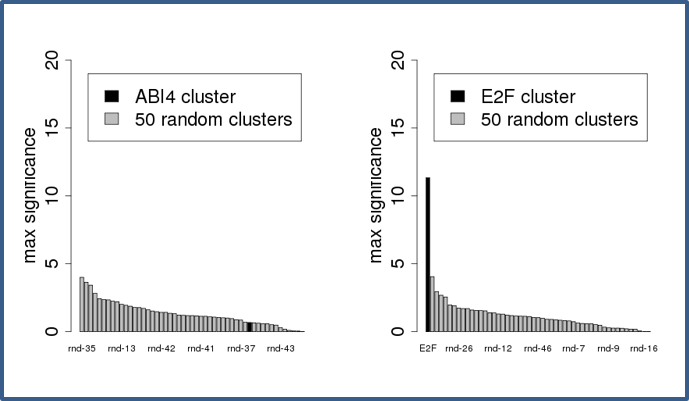

Motif discovery within clusters of upstream sequences in plant genomes
======================================================================

- [Introduction](#introduction)
- [Materials](#materials)
- [Methods](#methods)
	- [Collecting the full set of promoters for the genome of interest](#collecting-the-full-set-of-promoters-for-the-genome-of-interest)
	- [Analyzing upstream sequences of co-expressed genes](#analyzing-upstream-sequences-of-co-expressed-genes)
	- [Negative control: random groups of genes](#negative-control-random-groups-of-genes)
	- [Interpretation of results](#interpretation-of-results)
- [References](#references)
- [Notes](#notes)

This protocol explains step-by-step how to discover DNA motifs in regulatory regions of clusters of co-expressed gene in plants. It also explains how to control the significance of the result, and how to annotate the discovered motifs with putative binding fators. It uses the plant-dedicated mirror of the Regulatory Sequence Analysis Tools (RSAT, <http://plants.rsat.eu>) but it can be used on any RSAT mirror.

# Introduction

Transcriptome data (microarrays, RNA-seq) have been extensively used as a proxy for genetic regulation in many organisms, as the analysis of genome-wide profiles of gene transcription under different treatments uncovers clusters of genes with correlated behaviours, which may result from direct or indirect co-regulation. A classical application of this approach was done by Beer and co-workers (1) with yeast microarray data sets obtained in a variety of experimental conditions. In that experiment, expression data-mining was demonstrated to be an effective strategy for finding regulons, groups of genes that share regulatory mechanisms and functional annotations.

Other studies have unveiled that the outcome of these approaches largely depends on the genomic background of the species under study. For instance, Sand and others (2) reported that the significance of DNA motifs discovered in *Saccharomyces cerevisiae* promoters is much higher for regulons than for random gene sets of the same sizes, but for human promoters the signal-to-noise ratio is almost null, because random gene sets give highly significant motifs due to heterogeneities in promoter compositions and biases due to repetitive elements. For metazoans, it is thus a real challenge to distinguish *bona fide* motifs from noise (2). These observations suggest that motif discovery on sequence clusters faces intrinsic properties of the genomes under study, regardless of the software used for the task.

Among plants, these strategies have so far been tested on the model *Arabidopsis thaliana*, and they have been succesfully applied to the identification of novel cis regulatory elements validated with synthetic promoters (3). Yet, with the exception of this model, this sort of experiments have not been possible in plants until recently. In spite of this, the growing list of available plant genomes encourages these analyses in combination with expression profiles, as in the recent work of Yu and collaborators (4), provided that these factors are considered:

-   Plant genomes are rich in repetitive elements (RE) distributed along the genome (5), which pose particular problems for motif discovery statistics (violation of the independence assumption).

-   Current genome assemblies range from 119.7Mb (*A.thaliana*) to 14.54Gb (*Triticum aestivum*). *Brachypodium distachyon*, a model species for grasses, is 271.9Mb. The quality of these assemblies and their RE content is also quite variable (see stats [here](http://rsat.eead.csic.es/plants/data/stats/)).

-   Upstream regions, defined by annotated gene coordinates, are also of variable length.

This tutorial is step-by-step protocol for the task of discovering and annotating DNA motifs in clusters of upstream sequences for species supported on the RSAT::Plants server, which have been obtained mostly from Ensembl Plants (<http://plants.ensembl.org>, 6), but also include data from the JGI Genome Portal (<http://genome.jgi.doe.gov>) and the National Institute of Agrobiological Sciences in Japan (<http://barleyflc.dna.affrc.go.jp/bexdb/>). In addition, RSAT::Plants integrates footprintDB (<http://floresta.eead.csic.es/footprintdb>), a collection of position-specific scoring matrices (PSSM) representing transcription factor binding motifs (TFBM), as well as their cognate binding proteins (7), which can be used to annotate discovered motifs and to predict potentially binding transcription factors.

# Materials

This protocol requires to dispose of:

-   A computer with any Web browser installed.

-   A set of gene clusters from any of the species currently supported at RSAT::Plants ( <http://plants.rsat.eu>, see Note 1). 

# Methods

The following protocol enumerates the steps required to discover DNA motifs, based on the over-representation of k-mers (oligonucleotides) and dyads (spaced pairs of oligonucleotides), in clusters of upstream sequences. The protocol comprises two stages, analyzing first co-expressed genes and then random clusters as a negative control (see Note 3). Only after both stages have been completed it is possible to objectively estimate the relevance of the results.

The time required for carrying out the following steps is approximately one hour.

## Collecting the full set of promoters for the genome of interest

Before the proper analysis of the gene cluster, we will retrieve the promoter sequences of all the genes of the organism of interest, which will serve below to estimate the background model.

1.  Open a connection to the RSAT::Plants server (<http://plants.rsat.eu/>). On the left-side menu, select 'Sequence tools -\> retrieve sequence'.

2.  Choose 'Single organism' (see Note 1).

3.  Choose 'Genes -\> all'; this will retrieve all upstream sequences of the selected genome.

4.  Set appropriate upstream bounds. Default values are -2000,-1. To replicate the work of Yu et al *(4)* these should be set to 'From' -1000 'To' +200. Without prior knowlege of the exact upstream region boundaries, the proximal upstream sequences may be defined as windows of variable length, each one examined separately (see Note 10).  
As described by Ksouri et al *(8)* we define four promoter intervals as follows **Up 1**: [-1500bp, +200bp], **Up 2**: [-500bp, +200bp], **Up 3**: [-500bp, 0 bp], **Up 4**: [0bp, +200bp] (see **Figure 1**). <!--Najla, explica up1-up4-->

5.  We recommend to tick the option 'Mask repeats', as plant genomes are frequently repeat-rich. This option should not be used if you suspect the transcription factors of interest bind to repeated sequences.

6.  Press 'GO' and wait until the result page is displayed (see Note 4). The last row of the results table should include an URL to the 'sequences' file, which must be saved. We will refer to this URL as '**all.fasta.URL**'. This FASTA-format file can also be stored as a local file on your computer, note it can be rather large.    

 
  

## Analyzing upstream sequences of co-expressed genes

We will now retrieve the upstream sequences of a cluster of co-expressed genes, and use the tool *peak-motifs* to discover exceptional motifs in their promoters. The tool *peak-motifs* was initially conceived to discover motifs in ChIP-seq peaks, but it can also be used to analyze other sequence types, as illustrated here.

7.  Choose a cluster, copy the corresponding gene IDs and paste them in a new text file, that you will store on your computer. Insert newline characters between genes, see Note 5.

8.  In the left menu of the RSAT server, click on 'retrieve sequence' to get a fresh form. Make sure that the option 'Genes -\> selection' is activated. Tick 'Mask repeats', and set the same size limits as for the whole collection of promoters: from -1000 to +200. Paste the list of IDs of your gene cluster (one gene ID per row). <!-- Najla -->

9.  Press 'GO' and wait a few seconds until the result page is displayed. Inspection of these sequences might reveal N-masked sequence stretches, which correspond to annotated repeats. Save both 'query genes' and 'sequences' files to local files on your computer, we will refer to them as '**cluster.genes**' and '**cluster.fasta**' later on this protocol.

10.  Press the 'peak-motifs' button. **Peak sequences** are pre-filled with the cluster sequences selected on steps 7-8.

11.  Add a title for this job, such as 'cluster XYZ'.

12.  Paste the '**all.fasta.URL**' on the 'URL of a sequence file available on a Web server' entry form on the right side, as **Control sequences**.

13.  Click on 'Reduce peak sequences' and set an appropriate value to **Cut peak sequences +/-**. Suppress the default value (500) and leave the field blank, to avoid having the sequences clipped to 1Kb (by default, peak-motifs clips the peaks to 500bp on each side of the peak centers).

14.  Click on 'Motif discovery parameters'. Select two algorithms: 'Discover over-represented words' (**oligo-analysis**) and 'Discover over-represented spaced word pairs' (**dyad-analysis**). Uncheck the program **position-analysis** (see Note 6). Set 'Origin' to 'end' and 'Offset' to -200 (see Note 7).<!-- Najla -->

15.  Click on 'Compare discovered motifs with databases' and select appropriate databases which will be used to annotate any found motifs. For plant promoters, we recommend to check '*footprintDB-plants*', but you can also check other databases such as '*Athamap*', '*ArabidopsisPBM*' and '*JASPAR plants*' (see Note 8). You can also upload your own collection of DNA motifs in TRANSFAC format.

16. Select **email** output and type your delivery address as these are costly jobs and your connection to the server might get interrupted otherwise. Press 'GO'.

17. After few seconds the server should have uploaded the sequences and display a page with the URL of the future result page. You can already click on this link: the result page will be periodically updated to show the progress of the analysis. At the end of the processing, a box will appear at the top of the result page, with a short summary of the discovered motifs, and links to different sections of the results. Once the job is complete click on the link **[Download all results (peak-motifs\_archive.zip)]** to **save the results** on your computer. You will later be able to uncompress this archive in order to check the result after its removal from the server (results are only available on the server for 72 hours after job completion). We also recomment to download the full set of discovered motifs, by clicking on the link **[Download all matrices (transfac format)]** and saving a local file named '**cluster.motifs.tf**'. This file contains all motifs in the form of position-weight matrices (PWMs) in TRANSFAC format.

On the result page, the section entitled *'Discovered motifs (with motif comparison)'* lists the discovered motifs, displays their sequence logos and their distribution along clustered sequences, in addition to top matches with the motif databases selected on **step 15**.

## Negative control: random groups of genes

In this section, we propose a procedure to obtain an empirical estimation of the rate of false positives, by discovering motifs in the promoters of genes picked up at random.

18.  Select 'Build control sets -\> random gene selection'.

19.  Choose 'Organism'.

20.  Set 'Number of genes' to the size of the cluster used above. For convenience, in this tutorial only one random group is generated (the default), but this utility can generate several random groups in one go (see Note 9).

21.  Press 'GO' and click the 'Next step' button 'retrieve sequences' at the bottom of the result page. In the retrieve-seq form, set the other parameters as above: from -1000 to +200, check the 'Mask repeats' option. <!-- Najla -->

22.  Repeat steps 7-16. Save 'query genes' and 'sequences' files to local '**random.genes**' and '**random.fasta**' later on this protocol. 

## Interpretation of results

The last stage of the protocol is the interpretation of results, which requires having at hand results of both clusters of co-expressed genes and random clusters, which play the role of negative controls. 

**Figure 2** shows two **distributions of motif significance**. The most significant motif produced by both *oligo-analysis* and *dyad-analysis* (black bar) is shown next to the significance of motifs discovered in random clusters (grey bars). The motif on the left is not more significant than those of random gene sets of the same size, and should not be considered a reliable prediction. In contrast, the motif on the right (E2F) clearly supersedes those of random clusters. For this reason, it can be considered a promising prediction. 

See the protocol in reference (8) for further ways of validating motifs enriched in clustered sequences.

# References

1. MA Beer, S Tavazoie (2004) Predicting gene expression from sequence. Cell 117: 185–198. https://pubmed.ncbi.nlm.nih.gov/15084257

2. TJ Sand O., van Helden J. (2008) Evaluating the prediction of cis-acting regulatory elements in genome sequences, In: Frishman, D. and Valencia, A. (eds.) Modern genome annotation, pp. 55–89 Springer. https://link.springer.com/chapter/10.1007/978-3-211-75123-7_4

3. J Koschmann, F Machens, M Becker, J Niemeyer, J Schulze, L Bulow, DJ Stahl, R Hehl (2012) Integration of bioinformatics and synthetic promoters leads to the discovery of novel elicitor-responsive cis-regulatory sequences in Arabidopsis. Plant Physiol. 160: 178–191. http://www.plantphysiol.org/content/160/1/178

4. CP Yu, SC Chen, YM Chang, WY Liu, HH Lin, JJ Lin, HJ Chen, YJ Lu, YH Wu, MY Lu, CH Lu, AC Shih, MS Ku, SH Shiu, SH Wu, WH Li (2015) Transcriptome dynamics of developing maize leaves and genomewide prediction of cis elements and their cognate transcription factors. Proc. Natl. Acad. Sci. U.S.A. 112: E2477–2486. https://www.pnas.org/content/112/19/E2477

5. T Schmidt, J Heslop-Harrison (1998) Genomes, genes and junk: the large-scale organization of plant chromosomes. Trends in Plant Science 3: 195–199. https://doi.org/10.1016/S1360-1385(98)01223-0

6. KL Howe, B Contreras-Moreira B, N De Silva, et al. (2019) Ensembl Genomes 2020-enabling non-vertebrate genomic research. Nucleic Acids Res. 48: D689–D695. https://pubmed.ncbi.nlm.nih.gov/31598706

7. A Sebastian, B Contreras Moreira (2014) footprintDB: a database of transcription factors with annotated cis elements and binding interfaces. Bioinformatics 30: 258–265. https://pubmed.ncbi.nlm.nih.gov/24234003  

8. N Ksouri, J A. Castro-Mondragón, F Montardit-Tardà, J van Helden, B Contreras-Moreira, Y Gogorcena (2020). Motif analysis in co-expression networks reveals regulatory elements in plants: The peach as a model. bioRxiv 2020.02.28.970137; doi: https://doi.org/10.1101/2020.02.28.970137 

9. B Contreras-Moreira, J Castro-Mondragon, C Rioualen, et al. (2016) RSAT::Plants: Motif Discovery within Clusters of Upstream Sequences in Plant Genomes. In Plant Synthetic Promoters: Methods and Protocols, edited by Hehl R. Methods in Molecular Biology, 1482:279-95. https://pubmed.ncbi.nlm.nih.gov/27557774

# Notes

[1] As gene models can change from one assembly to another it is important to use the right assembly version. If the assembly of interest it not available on RSAT::Plant server, please contact us.

[2] Smaller clusters are left out of the analysis, as the statistical approaches in this protocol require at least ~10-15 sequences. 

[3] A crucial parameter to evaluate the results of motif discovery is to estimate the rate of false positives (FP). RSAT programs compute a significance score, which is the minus log of the expected number of false positives. For example, a motif associated with a significance of 1 should be considered as poorly significant, since on average we would expect 0.1 false positives, i.e. one FP every 10 random trials. In contrast, a significance of e.g. 16 is very promising, since on average such a result would be expected every 10E-16 random trials. However, the theoretical significance relies on the correctness of the background model (computed here as k-mer and dyad frequencies in the whole set of promoters). In some cases, sets of plant promoters can discard from the theoretical model, due to heterogeneity of the input (e.g. inclusion of repetitive sequences). The negative control consists in measuring the significance obtained by submitting a random selection of promoters from the organism of interest (maize in the example). Although each of these genes is likely to be regulated by one or more transcription factors (and its promoter should contain corresponding binding sites), in principle the random set as a whole should not be co-regulated, so that the elements would differ from gene to gene, and there should thus be no over-represented motif in their promoters.

[4] Should the connection to the server interrupt it might be safer to go back and choose 'email' as delivery option.

[5] It is crucial to have one gene ID per row for submitting queries to retrieve-seq, because only the first word of each row is considered as a query.

[6] This program is generally relevant when analyzing sets containing a large number of sequences such as ChIP-seq peaks or genome-wide promoter sets.

[7] The option *'Origin'* indicates the reference position relative to each sequence (start, center or end). When this option is set to 'end', the coordinates are computed relative to the end of the sequence, with negative values indicating upstream location. The option *'Offset'* enables to shift the reference point by a given number. 

[8] Plant transcription databases are unfortunately still very fragmentary, so one might be tempted to check more complete collections such as *footprintDB* or *JASPAR core all*. However, the results should be interpreted with caution, because there is no conservation of cis-regulation between Plants and other Kingdoms of the tree of life.

[9] Clearly, more than one random cluster should be evaluated, as suggested on **Figure 2**, where the results of up to 50 random groups are displayed.
